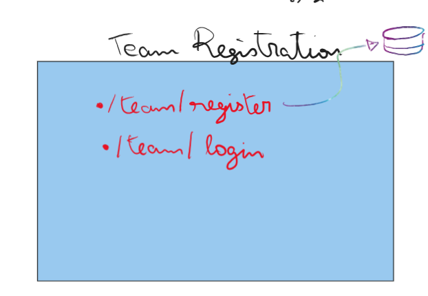
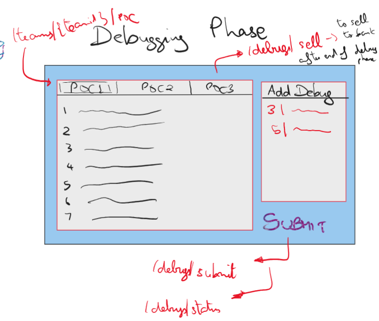
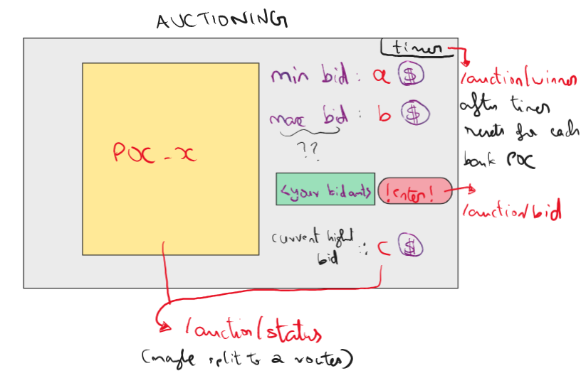

# Codopoly-Kriya2025

## Run Using Docker - backend

1. **Pull the Docker Image - http server**
   
   ```bash
   docker pull darshan122205/codopoly-http:latest
   ```
2. **Run the Docker Container - http server**
   
   ```bash
   docker run -p 6000:6000 --env-file .env darshan122205/codopoly-http:latest
   ```
3. **Pull the Docker Image - socket server**
   
   ```bash
   docker pull darshan122205/codopoly-socket:latest
   ```
4. **Run the Docker Container - http server**
   
   ```bash
   docker run -p 6001:6001 --env-file .env darshan122205/codopoly-socket:latest
   ```

---

## Table of Contents

1. [Event Flow](#event-flow)
2. [API Endpoints](#api-endpoints)

## Event Flow

### Registration/Login



### Debugging Phase



### Auctioning Phase

#### Pre-Auction:


#### Auctioning:



<a id="eventflow"></a>

## API Endpoints

### Teams

| Endpoint       | Method | Purpose                   |
| -------------- | ------ | ------------------------- |
| /team/register | POST   | Register a new team       |
| /team/login    | POST   | Team Login                |
| /team/details  | GET    | Get specific team details |

### Debugging phase

| Endpoint         | Method | Purpose                   |
| ---------------- | ------ | ------------------------- |
| /debug/poc       | GET    | Get team's part of code   |
| /debug/submit    | POST   | Submit their added debugs |
| /debug/getdebugs | GET    | Get submitted debugs      |

### Pre-Auction phase

| Endpoint | Method | Purpose                          |
| -------- | ------ | -------------------------------- |
| /bank    | GET    | Get the list of POCs in the bank |

### Auctioning phase

| Endpoint          | Method | Purpose                            |
| ----------------- | ------ | ---------------------------------- |
| /admin/sold       | POST   | Mark a POC as sold                 |
| /admin/biddingPOC | POST   | Update the currently auctioned POC |

### Admin

| Endpoint                 | Method | Purpose                   |
| ------------------------ | ------ | ------------------------- |
| /admin/login             | POST   | Admin login               |
| /admin/register          | POST   | Register a new admin      |
| /admin/teamCount         | GET    | Get total number of teams |
| /admin/changeEventStatus | POST   | Change event phase status |

### Questions

| Endpoint         | Method | Purpose           |
| ---------------- | ------ | ----------------- |
| /question/       | GET    | Get all questions |
| /question/submit | POST   | Submit a question |

<a id="apiendpoints"></a>

